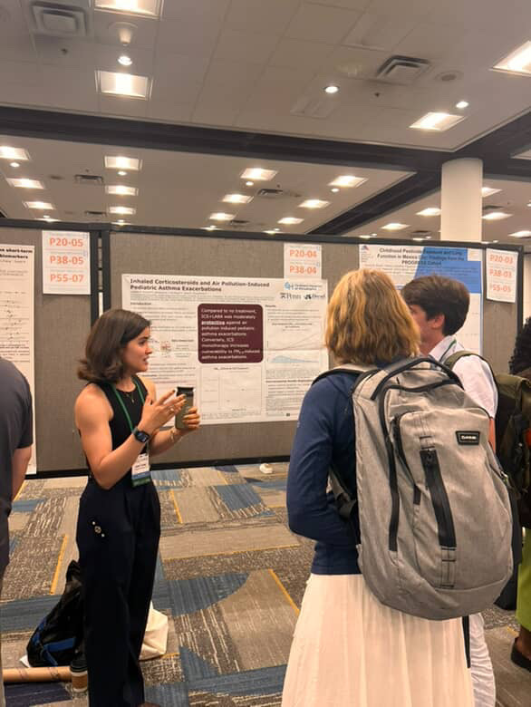
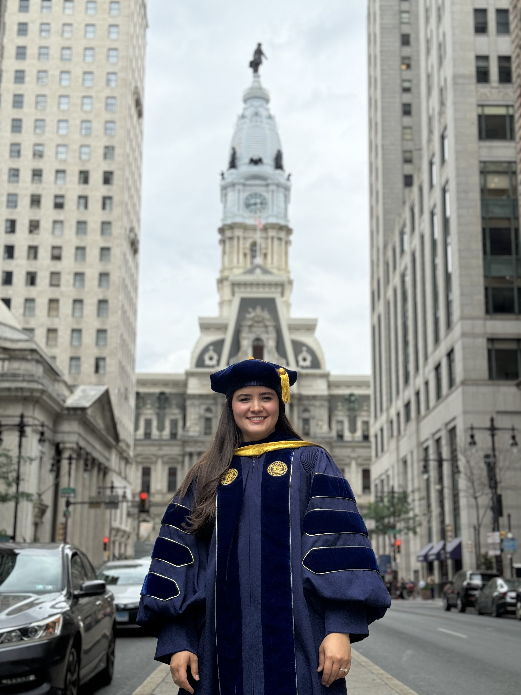

```{r}
#| column: margin
#| out-width: "200%"



```

I am a postdoctoral associate at the [Center for Climate, Health and Healthcare](https://ifh.rutgers.edu/research/centers-and-programs/research-centers/center-for-climate-health-and-healthcare/) at Rutgers University, where I study how climate exposures — extreme heat, wildfire smoke, PM2.5 — interact with medication use to shape health outcomes in vulnerable populations. My work links national Medicaid data with gridded climate data to examine drug-environment interactions with direct policy implications.

Previously, I was a postdoctoral researcher in the Department of Biostatistics, Epidemiology and Informatics at the Perelman School of Medicine, University of Pennsylvania, where I conducted comparative effectiveness studies using electronic health records from Penn Medicine.

I completed my doctoral training at Drexel University's [Dornsife School of Public Health](https://drexel.edu/dornsife/academics/departments/environmental-occupational-health/) in Philadelphia, under the mentorship of Dr. Jane Clougherty. My dissertation examined how social and environmental factors modify the efficacy of pharmaceutical treatments for asthma — bringing an environmental science lens to questions that clinical research has typically treated in isolation.

Prior to Drexel, I earned a Master of Public Health from [Columbia University Mailman School of Public Health](https://www.publichealth.columbia.edu/academics/departments/environmental-health-sciences-ehs), and a Bachelor of Science in Biology from the [City College of New York](https://www.ccny.cuny.edu/).

My interest in environmental health and health equity took shape through a fellowship with the Puerto Rico IPE Service Learning Program, where I worked with a community team on a participatory research project in San Juan. That experience grounded my commitment to research that is rigorous, reproducible, and relevant to the communities it aims to serve.

---

Outside of research, I am usually hosting friends for dinner, tending to my garden, baking, or reading fiction.
